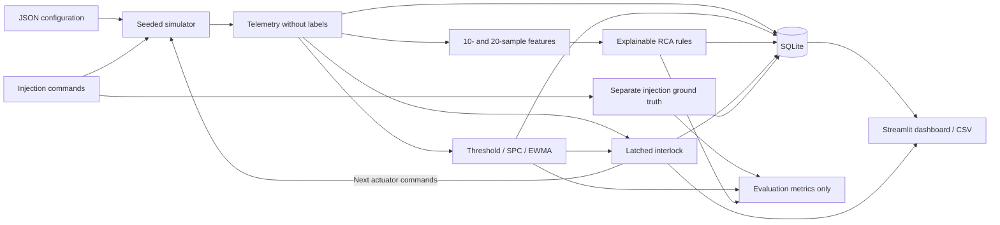
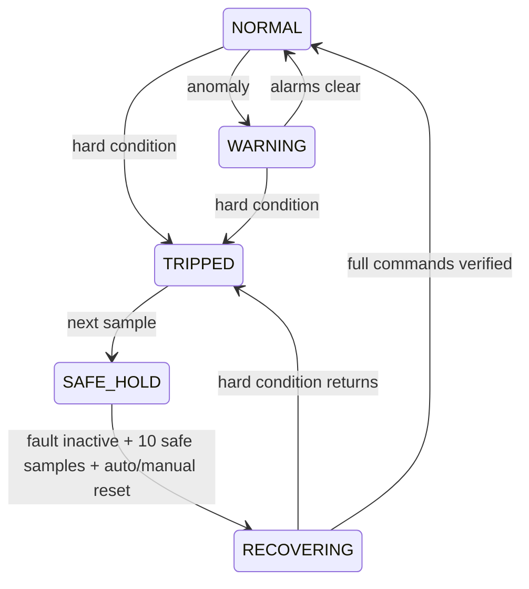

# virtual-semiconductor-equipment-monitor

A complete Windows-local, CPU-only **Virtual Semiconductor Equipment Anomaly
Monitoring & Fault Diagnosis** demo. A seeded etch-like virtual machine generates
five telemetry signals, injects four synthetic signatures, detects anomalies,
ranks explainable causes, executes a latched interlock and recovery sequence,
and persists run history in SQLite. Streamlit provides the local dashboard.

**All equipment values, limits, equations and fault signatures are synthetic
demonstration parameters. They are not real semiconductor equipment limits,
TSMC recipes, fab specifications, or validated physics. This is not an equipment
safety controller or a validated diagnostic system.**

## Windows setup

Install a Python **3.12.x** interpreter with the Windows `py` launcher. No
particular patch version is required. Open PowerShell in this project directory:

```powershell
cd C:\project\TSMCEE\virtual-semiconductor-equipment-monitor
py -3.12 -m venv .venv
.venv\Scripts\Activate.ps1
python -m pip install --upgrade pip
pip install -r requirements-dev.txt
python -m pip check
```

On the delivery workstation, `.venv` already contains Python 3.12.13 and the
installed packages. To use that prepared environment directly:

```powershell
.\.venv\Scripts\python.exe -m pytest -q
.\.venv\Scripts\python.exe -m streamlit run app.py
```

The workstation's legacy `py -3.12` selector does not recognize the uv-managed
interpreter's vendor tag. If creating a new environment on this workstation,
use its registered selector instead of the first standard setup command:

```powershell
py -V:Astral/CPython3.12.13 -m venv .venv
```

This vendor-specific selector is a workstation detail, not a project patch
version requirement.

If PowerShell blocks activation, use a process-scoped policy for this terminal:

```powershell
Set-ExecutionPolicy -Scope Process -ExecutionPolicy Bypass
.venv\Scripts\Activate.ps1
```

Core requirements are exactly `streamlit==1.64.0`, `numpy==2.5.3`, and
`pandas==3.0.6`; development adds `pytest==9.1.1`. Storage uses Python's
`sqlite3`. No Docker, external database server, cloud account, GPU, or special
hardware is needed. After packages are installed, runtime works offline.
Streamlit usage-stat reporting is disabled by `.streamlit/config.toml` and the
server binds to loopback. No application-level network requests are made.

## Run, test and evaluate

```powershell
pytest -q
python tools\generate_dataset.py --repeats 100 --seed 42
python tools\evaluate.py --repeats 100 --seed 42
streamlit run app.py
```

Open [http://localhost:8501](http://localhost:8501). Stop the server with Ctrl+C.
Batch commands advance simulated time without sleeping.

Rebuild verification (2026-09-19, Python 3.12.13): the core environment passed
59 tests with 2 optional tests skipped; after installing the optional packages,
all 61 tests passed. The Streamlit tests exercise all four fault selections,
injection, ACK latch behavior and completed-run CSV export. `pip check` and
SQLite integrity/foreign-key checks passed. Fresh batch generation produced
500 completed runs and 60,000 samples; the Monte Carlo CSVs were regenerated.

`generate_dataset.py` creates 100 normal controls and 100 runs of each fault:
500 runs / 60,000 samples. It appends runs to `data/equipment.db` and replaces
`artifacts/dataset.csv` with telemetry for that invocation. Ground-truth labels
are kept separately in `fault_injections`, not in telemetry CSV columns.
Repeated invocations append new run IDs; they do not erase DB history.

`evaluate.py` defaults to 100 repetitions **per fault** and 100 normal-only runs.
Use `--normal-runs N` to change the control count. It writes
`artifacts/evaluation_summary.csv` and `artifacts/evaluation_by_run.csv`, and
prints a readable console table. Evaluation runs use memory and do not append
to SQLite. Results are **not measured** until this command has been run; no
fallback or invented performance numbers are used.

Paths are resolved relative to the project files with `pathlib`, so batch
scripts also work when called from another working directory. Launch Streamlit
from the project directory so its local theme and offline settings are read.

## Dashboard walkthrough

1. A new run starts with 60 normal samples to fit the baseline. Keep the browser
   tab open; live sampling advances one simulated second per real second.
2. Select any of the four fault types and a duration (default 30 s), then click
   **Inject Fault**. Injection is rejected before baseline completion, while a
   fault is active, or while the interlock is latched.
3. Watch the five metric cards, the last 120 seconds of sensor trends, alarms,
   ranked RCA candidates, heuristic scores, and observed evidence values.
   Chart tabs include actual values, SPC UCL/LCL and EWMA. Built-in Streamlit
   Vega-Lite charts fit their y-axes to observed values so small sensor changes
   remain visible; control limits use dashed lines.
4. Default cooling and vacuum signatures can reach their hard trip limits.
   **ACK** records acknowledgement and leaves the latch, reason and commands
   unchanged. The event panel records critical trips and recovery transitions.
5. With **Auto Recovery** enabled, recovery begins after the fault ends and
   ten consecutive safe samples arrive. Disable it to use **Manual Reset**;
   manual reset enforces exactly the same eligibility conditions.
6. **Complete Run** stops sampling and records an end timestamp. **Export Run
   CSV**, followed by **Download run CSV**, exports a snapshot from SQLite.
   **Reset Simulation** completes the previous run and starts a fresh one with
   the selected seed. It does not delete history.
7. Open **Persistent run history & export**, click **Refresh History**, and
   select any saved run to inspect events/diagnoses or download its CSV.

The live region uses `@st.fragment(run_every=1.0)`. A monotonic time gate prevents
widget reruns from advancing extra simulated seconds. There are no application
background threads. Long scheduling delays skip wall-clock catch-up; a hidden
tab, sleeping laptop or overloaded machine may slow live time. Browser refresh
may discard the current in-memory simulation and create a new run, but existing
SQLite history remains available. Such interrupted runs have a NULL end time;
they can still be exported. Each browser session has its own simulator and
controller. Live memory holds at most 120 samples/ticks; SQLite is the history
source. UI operations apply between sample ticks.

## Architecture



`monitor.py` is the small shared coordinator used by Streamlit and both batch
tools. The safety controller receives only an active/inactive fault boolean
for recovery eligibility, never a fault identity. `features.py`, `detectors.py`
and `rca.py` never receive, import or query injection metadata. RCA's only API
input is a `FeatureSet`. Tests reject an added `fault_type` API argument and
check those modules for injection-table/label access.

## Normal model and timing

Sampling is 1 Hz. Each signal uses `numpy.random.default_rng(seed).normal()`.
All RNG is private to a simulator; matching seeds and commands reproduce sensor
values. Run IDs and run-start wall-clock timestamps are administrative metadata
and differ between runs. `Simulator` also supports a fixed explicit start time
and defaults to one for exact telemetry-record tests.

| Signal | Normal mean | Noise sigma |
|---|---:|---:|
| Temperature (°C) | 60.0 | 0.25 |
| Pressure (mTorr) | 10.0 | 0.15 |
| Gas flow (sccm) | 100.0 | 0.50 |
| RF power (W) | 500.0 | 2.0 |
| Pump current (A) | 3.0 | 0.04 |

Every batch run has exactly 120 samples: indices 0–59 baseline, 60–89 fault
(or normal control), and 90–119 post-fault. At the first active sample `t=1`;
at the last active sample `t=30`. The injection is inactive at index 90.

| Synthetic fault | Noise-free signature while active |
|---|---|
| VACUUM_LEAK | pressure = 10 + 0.40t; current = 3 + 0.005t |
| COOLING_FAILURE | temperature = 60 + 0.55t |
| GAS_FLOW_DRIFT | flow = 100 − 0.50t; pressure = 10 − 0.02t |
| PUMP_DEGRADATION | current = 3 + 0.020t; pressure = 10 + 0.12t |

Unlisted signals stay near normal before safety action. Independent sensor
noise is added to these targets. After fault expiry, affected process signals
return using `x_next = x + 0.25 * (target - x) + noise` until close to baseline.
Safety actuator commands take precedence: RF follows its command, and the gas
target scales with demanded gas. Actuator readings are clipped at zero to avoid
negative RF/flow noise when shut down. Shutdown and ramp tracking are simplified
demo behavior, not a physical actuator model. Fault signatures continue until
expiry even if a trip has shut off RF and gas.

## Detection and features

All methods return `DetectionResult(method, signal, alarm, severity, score,
message)` objects. Warning thresholds are distinct from safety trips:

| Signal | Warning band (inclusive) | Hard trip |
|---|---|---|
| Temperature | 55–68 °C | ≥75 °C |
| Pressure | 8–13 mTorr | ≥20 mTorr |
| Gas flow | 90–110 sccm | ≤80 sccm at full gas demand |
| RF power | 450–550 W | none |
| Pump current | 2.5–3.30 A | ≥4.0 A |

- **ThresholdDetector:** warning outside the configured inclusive warning band.
- **SPCDetector:** mean and sample standard deviation (`ddof=1`) fitted from the
  first 60 normal samples. Limits are mean ± 3 std. A raw violation is `abs(z)>3`;
  two raw violations among the last three samples confirm an alert.
- **EWMADetector:** lambda=0.20, k=3.0; initialize at baseline mean and update
  `EWMA = lambda*x + (1-lambda)*previous`. The steady-state standard deviation is
  `std*sqrt(lambda/(2-lambda))`; limits are baseline mean ± k times that value.

These are project parameters, not equipment specifications. The combined alarm
is the OR of all signal/method alerts. Single-channel limits do not imply a
system-wide false-positive guarantee. An event is emitted when a signal/method
enters alarm, not for every sustained alarm sample. Display diagnosis episodes
close after three clear samples; the metric below uses contiguous alarm samples.

Features over up to 10 samples are last value, baseline z-score, mean, sample
standard deviation and least-squares slope per simulated second. Up to 20 samples
provide pressure/current Pearson-style correlation using NumPy. Constant-series
correlation is undefined (`None`). Correlation is available as a diagnostic
feature and is not an extra hidden RCA scoring rule. The baseline stays fixed
for the run. Detector histories reset after interlock recovery; control-affected
samples are excluded from RCA windows. Anomaly/RCA monitoring is inhibited while
latched, while the hard-safety checks continue. The dashboard explicitly labels
the last retained diagnosis during hold and ramp.

## Explainable RCA

Each candidate sums the following evidence weights. Near baseline means
`abs(last-value baseline z) <= 3`. Scores are **heuristic evidence scores, not
calibrated probabilities**, and scores across causes do not need to sum to one.

| Candidate | Evidence weights |
|---|---|
| VACUUM_LEAK | +0.45 pressure z>3; +0.35 pressure slope>0.25; +0.10 current slope strictly between 0 and 0.012; +0.10 temperature and flow near baseline |
| COOLING_FAILURE | +0.45 temperature z>3; +0.35 temperature slope>0.35; +0.10 pressure near baseline; +0.10 flow near baseline before interlock |
| GAS_FLOW_DRIFT | +0.45 flow z<−3; +0.35 flow slope<−0.30; +0.10 temperature near baseline; +0.10 current near baseline |
| PUMP_DEGRADATION | +0.35 current z>3; +0.35 current slope>0.015; +0.20 pressure slope in [0.05, 0.20]; +0.10 temperature and flow near baseline |

Top score <0.65 produces **UNKNOWN**. Otherwise a top-two margin ≤0.10 produces
**AMBIGUOUS**, displaying both candidates. Ties use deterministic alphabetical
ordering. The API retains all four candidates, matched evidence and observed
values. Ranking updates from measured windows during eligible alarms. No model
is given the injected label.

## Latched interlock



Trip immediately latches the controller, saves the reason, commands RF=0 W and
gas=0 sccm, and emits a CRITICAL event. The trip sample describes the measurement
that caused the action; the next sample reflects the new commands. ACK only
creates an event. The latch remains set throughout SAFE_HOLD and RECOVERING.

Recovery requires fault inactive and **10 consecutive** samples satisfying all
of temperature<68 °C, pressure<13 mTorr and current<3.30 A. A failed sample resets
the count. Auto Recovery starts the ramp automatically; Manual Reset starts it
only after the same eligibility checks. Ramp commands increase RF by 100 W/s
and gas by 20 sccm/s to 500 W / 100 sccm. One subsequent sample at full command
must pass the hard conditions before clearing the latch. Any hard condition
during recovery immediately retrips and zeros both commands.

**Low-flow command permissive:** gas≤80 is tested only at the full 100-sccm
demand. Zero flow during hold and low flow during partial ramp are intentional;
applying the unconditional low-flow trip there would make recovery impossible.
Temperature, pressure and current safety checks remain enabled throughout the
ramp. Low-flow protection resumes at full demand, before unlatching. This is an
explicit demo interpretation of the requested safety/ramp rules. It is not a
real equipment safety policy.

## Persistence

`data/equipment.db` contains `runs`, `telemetry`, `fault_injections`, `events`,
and `diagnoses` with the specified fields. Indexes cover `(run_id, sample_idx)`
in telemetry, events and diagnoses. Foreign keys and a unique telemetry
`(run_id, sample_idx)` prevent orphaned/duplicate sample writes. Every connection
uses a context manager and closes explicitly. SQL values are parameterized.
Live samples/events/diagnoses commit together per tick; batches use one data
transaction per run. Diagnosis evidence JSON contains the decision, ambiguity,
all candidates and features. Completed and interrupted histories survive refresh.

## Metric definitions and interpretation

The detector baseline uses samples 0–59. Detection is scored on [60,90).
Evaluation consults injection ground truth only after telemetry analysis.

| Metric | Definition |
|---|---|
| Detection latency (s) | first alarm sample index − 60, times sample period; 0 means the first fault sample; misses have no latency |
| Detection rate | fault runs with an alarm during the active interval / all fault runs |
| Sample false-positive rate | alarm samples / eligible normal samples, measured on the final 60 samples of each normal-only run |
| False alarm episodes | number of contiguous alarm-sample segments in eligible normal-only samples |
| RCA Top-1 accuracy | correct first-ranked cause / all fault runs |
| RCA Top-2 accuracy | true cause in first two ranks / all fault runs |

RCA accuracy uses the **first non-UNKNOWN diagnosis during the active interval**,
not the best later diagnosis. Missing/UNKNOWN diagnoses count as wrong. AMBIGUOUS
diagnoses retain ranked top-1/top-2 and an ambiguity flag. The denominator
includes every fault run. Latency aggregates are conditional on detection, so
read them together with detection rate. Undefined/non-applicable metrics are
blank in CSV and NaN in the console. Post-fault residuals, deliberate safety
commands and training samples are not normal negatives for the FPR estimate.
Seeds are `base_seed + repetition`, matched across fault/control conditions.

Reference execution on Python 3.12.13 with the pinned core packages, seed 42,
100 repeats per fault and 100 normal controls produced the following measured
results (2026-09-19). The CSV artifacts contain the underlying run-level results:

| Fault | Detection rate | Mean latency (s) | RCA Top-1 | RCA Top-2 |
|---|---:|---:|---:|---:|
| Vacuum leak | 1.00 | 1.01 | 0.99 | 1.00 |
| Cooling failure | 1.00 | 1.12 | 1.00 | 1.00 |
| Gas flow drift | 1.00 | 2.40 | 1.00 | 1.00 |
| Pump degradation | 1.00 | 2.75 | 0.36 | 0.77 |

Normal controls produced an FPR of 0.0311667 (187/6000 samples) and 111 false
alarm episodes. These are observations of this constructed simulator, not
validated performance on semiconductor equipment. No heuristic was changed to
hide the weaker early pump diagnosis. Early pressure evidence can resemble a
vacuum leak before enough pump-current slope evidence accumulates.

## Optional statistics and ML

```powershell
pip install -r requirements-optional.txt
python -m pip check
pytest -q
```

This adds exactly `scipy==1.18.1` and `scikit-learn==1.9.1`. Core runtime and the
dashboard do not import either dependency. Optional ML tests call
`pytest.importorskip("sklearn")` and skip cleanly in the core environment.

`stat_analysis.py` lazily loads SciPy when a helper is called. It exposes
`welch_t_test(first, second)` with `equal_var=False`, `pearson_correlation`, and
`matched_seed_effect(fault_by_seed, control_by_seed)`. The matched helper requires
identical seed sets and one aggregate per run; it reports mean paired effect,
standard error and a t-based 95% interval.

Adjacent time-series samples may be autocorrelated and must not blindly be
treated as independent observations. P-values are supporting diagnostic
evidence, not proof of root cause. Correlation is not causation. Matched same-seed
fault/control comparisons establish effects only inside this simulator
construction, not in real semiconductor equipment.

`MLDetector.fit(windows, labels)` trains a lazily imported IsolationForest with
`n_estimators=200`, `contamination="auto"`, `random_state=42`. Only rows labelled
`NORMAL` are used. Supply consistently ordered numeric feature windows from
curated fault-free training runs; a merely unalarmed equipment state is not
enough to establish a clean training label. Keep held-out runs/seeds separate.
`detect(window)` returns an uncalibrated anomaly score. ML is not required or
enabled by `app.py`; the sidebar reports availability without importing sklearn.

## Limitations

- Synthetic signatures and simplified actuator/recovery behavior, not validated physics.
- Single concurrent fault; no fault mixtures, recipe phases or sensor failures.
- Fixed baseline, fixed project thresholds, and short feature windows.
- Weak early pump-degradation discrimination under the requested rules (see actual results).
- EWMA and multiple monitored signals produce nonzero normal false alarms.
- Hard trip timing depends on noise; a 30-s flow/pump fault need not reach a trip threshold.
- A 30-s post-fault period is an evaluation window, not a guaranteed recovery deadline.
- Live timing depends on browser/server scheduling; refresh does not resume live objects.
- CSV exports telemetry snapshots; full event/diagnosis/injection history remains in SQLite.
- IsolationForest is optional, not a benchmarked or validated diagnosis system.

## Project tree

```text
virtual-semiconductor-equipment-monitor/
  README.md
  requirements.txt
  requirements-dev.txt
  requirements-optional.txt
  .gitignore
  .streamlit/config.toml
  pytest.ini
  app.py
  config/
    equipment.json
    faults.json
  data/
    .gitkeep
    equipment.db                 # generated
  artifacts/
    .gitkeep
    dataset.csv                  # generated
    evaluation_summary.csv       # measured by evaluate.py
    evaluation_by_run.csv        # measured by evaluate.py
  virtual_equipment/
    __init__.py
    models.py
    config.py
    faults.py
    simulator.py
    storage.py
    features.py
    detectors.py
    rca.py
    interlock.py
    monitor.py
    stat_analysis.py
    metrics.py
    ml_detector.py
  tools/
    generate_dataset.py
    evaluate.py
  tests/
    conftest.py
    test_simulator.py
    test_faults.py
    test_detectors.py
    test_rca.py
    test_interlock.py
    test_storage.py
    test_metrics.py
    test_ml_detector.py
    test_app.py
```
